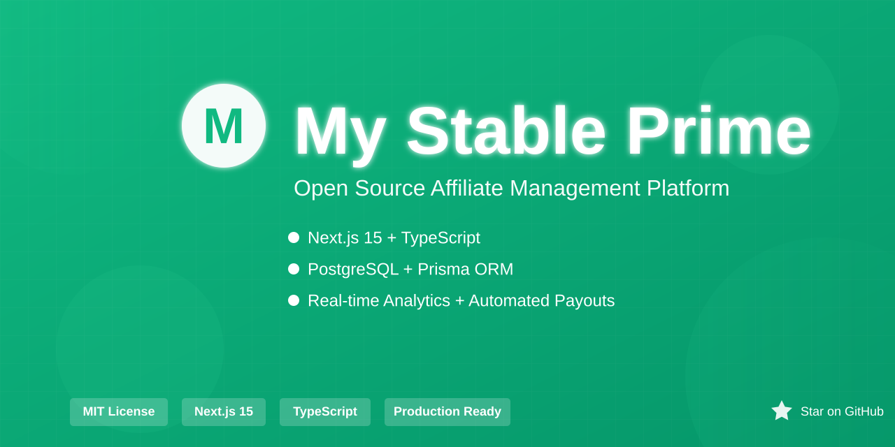

# My Stable Prime – Open Source Affiliate Management Platform

[](https://opensource.org/licenses/MIT)
[](https://opensource.org/)
[](CONTRIBUTING.md)
[](https://buymeacoffee.com/mystableprime)

<p align="center">
  
</p>

<p align="center"><strong>A powerful, feature‑rich affiliate marketing platform built with Next.js 15, TypeScript, Prisma and PostgreSQL.</strong></p>

---

## 📋 About

**My Stable Prime** enables businesses to launch, run and scale affiliate programs. It provides:
- A fully‑featured **admin dashboard** for managing partners, commissions and payouts.
- A sleek **affiliate dashboard** where partners can track earnings, submit leads and access marketing assets.
- **Real‑time analytics** powered by WebSockets for instant performance insights.
- **Robust authentication** with JWT, OTP verification and secure password hashing.
- **Automated workflows**: commission calculation, payout scheduling and email notifications via Resend.
- **Extensible architecture** – plug‑in new payment providers, add custom commission rules or integrate third‑party analytics.

---

## ✨ Features

### Admin Panel
- **Analytics Dashboard** – revenue, conversion rates, partner performance metrics.
- **Partner Management** – approve/reject applications, group partners, set custom commission rates.
- **Referral Management** – review leads, change status, bulk operations.
- **Commission & Payout Engine** – automatic calculations, NET‑15/NET‑30 schedules, multi‑method payouts (PayPal, Stripe, Bank Transfer).
- **Program Settings** – branding, cookie tracking, country blocking, terms of service.
- **Email Automation** – welcome, referral, commission and payout notifications.

### Affiliate Dashboard
- **Personal Earnings Overview** – total, pending, paid breakdown.
- **Lead Submission** – manual entry, status tracking, conversion metrics.
- **Marketing Resources** – unique referral link, shareable code, social sharing buttons.
- **Payout Tracking** – history, upcoming schedule, method configuration.
- **Account Settings** – profile, payment methods, notification preferences.

### Core Platform
- **Next.js 15 (App Router)** – server‑components, edge‑runtime, type‑safe routing.
- **Prisma ORM** – type‑safe DB access, migrations, row‑level security policies.
- **PostgreSQL** – relational data store with RLS for deep security.
- **JWT (jose) + OTP** – secure authentication flow.
- **bcryptjs** – password hashing.
- **Tailwind CSS** – utility‑first styling, dark mode ready.
- **Recharts** – interactive data visualisation.
- **Resend** – transactional email service.
- **WebSocket (socket.io)** – real‑time notifications and messaging.
- **BullMQ** – background job processing for email and web‑push queues.

---

## 🛠️ Tech Stack

- **Framework**: Next.js 15.2.3, React 19
- **Language**: TypeScript
- **Database**: PostgreSQL 14+, Prisma
- **Auth**: JWT (jose), OTP, bcryptjs
- **Styling**: Tailwind CSS
- **Charts**: Recharts
- **Email**: Resend API
- **Background Jobs**: BullMQ (Redis)
- **Realtime**: Socket.io (WebSockets)
- **Linting/Formatting**: ESLint, Prettier

---

## 🚀 Installation

### Prerequisites
- Node.js ≥ 18
- PostgreSQL ≥ 14
- npm / yarn / pnpm

### Steps
```bash
git clone https://github.com/yourusername/mystableprime.git
cd mystableprime

# Install dependencies (web + mobile + Prisma client)
npm run setup

# Create .env.local (copy from .env.example)
cp .env.example .env.local
# Fill in required values (DATABASE_URL, JWT_SECRET, RESEND_API_KEY, etc.)

# Set up database
npx prisma db push   # creates schema
# (optional) seed sample data
npx prisma db seed

# Run dev server
npm run dev
```
Open `http://localhost:3000`.

> The Expo / React Native app under `mobile/` is a self-contained npm
> project with its own `package.json` and `tsconfig.json`. It is excluded
> from the Next.js build (`tsconfig.json` and `.dockerignore`). Use
> `npm run setup:mobile` to install its dependencies, and develop it via
> `cd mobile && npm start` (Expo).

---

## 📦 Deployment

### Vercel (recommended)
1. Push the repo to GitHub.
2. Import the project in Vercel.
3. Add all environment variables from `.env.local`.
4. Deploy – Vercel builds and serves the app.

### Self‑hosted (Docker)
```bash
docker compose -f docker-compose.yml -f docker-compose.prod.yml up -d --build
# Ensure DATABASE_URL points to a managed PostgreSQL instance.
```
See `docs/DEPLOYMENT.md` for full details.

---

## 📚 Documentation
- **API Reference** – `docs/API.md`
- **Deployment Guide** – `docs/DEPLOYMENT.md`
- **Database Schema** – `docs/DATABASE.md`
- **Email Configuration** – `docs/EMAIL.md`
- **Contributing** – `CONTRIBUTING.md`

---

## 🗂️ Project Structure
```
mystableprime/
├─ prisma/               # Prisma schema & migrations
├─ public/               # Static assets
├─ src/
│  ├─ app/               # Next.js App Router (pages, api)
│  │  ├─ admin/          # Admin UI routes
│  │  ├─ affiliate/      # Affiliate UI routes
│  │  ├─ api/            # Backend API routes
│  │  └─ auth/           # Authentication endpoints
│  ├─ components/        # Reusable React components
│  ├─ hooks/             # Custom React hooks
│  ├─ lib/               # Core libraries (services, utils)
│  └─ middleware.ts     # Global middleware (auth, rls)
├─ docs/                 # Documentation files
├─ .env.example          # Example env config
├─ next.config.js        # Next.js configuration
├─ tailwind.config.ts    # Tailwind configuration
└─ README.md             # This file
```

---

## 🔧 Configuration
All configuration is validated at start‑up via Zod (`src/lib/schemas.ts`). Key variables:
- `DATABASE_URL` – PostgreSQL connection string (required).
- `JWT_SECRET` – secret for signing tokens (required).
- `RESEND_API_KEY` – Resend email API key (required for email notifications).
- `ADMIN_EMAILS` – comma‑separated list of admin notification recipients.
- Optional Stripe keys for payout integration.

---

## 🤝 Contributing
We welcome contributions! See the [Contributing Guide](./CONTRIBUTING.md) for:
1. Fork the repository.
2. Create a feature branch.
3. Run tests with `npm test`.
4. Submit a pull request.

---

## 📄 License
This project is licensed under the **MIT License** – see the [LICENSE](./LICENSE) file.

---

## 👨‍💻 Author
Developed by the **My Stable Prime Team**.
- GitHub: [@mystableprime](https://github.com/mystableprime)
- Website: https://mystableprime.com

---

## 📞 Support
- **Documentation**: `docs/`
- **Issues**: <https://github.com/yourusername/mystableprime/issues>
- **Discussions**: <https://github.com/yourusername/mystableprime/discussions>

---

## 🌟 Show Your Support
- ⭐ Star the repository
- 🐛 Report bugs
- 💡 Suggest new features
- 🔀 Submit PRs

---

<p align="center">
  Made with ❤️ by the <strong>My Stable Prime Team</strong>
</p>

<p align="center">
  <sub>© 2025 My Stable Prime. All rights reserved.</sub>
</p>
