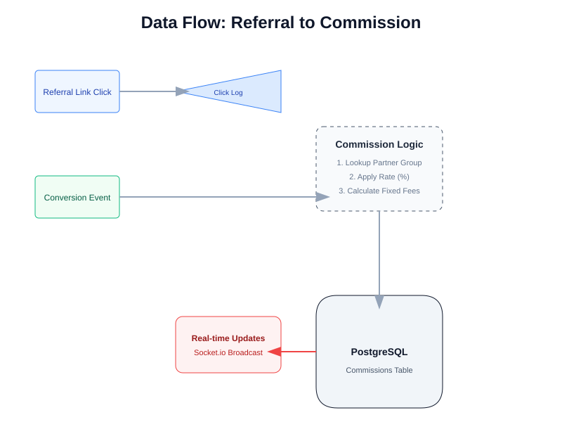

# 🚀 My Stable Prime (MSP) – Codebase Status Update

**Date:** May 7, 2026  
**Project Version:** v1.3.0 (Production Ready)  
**Status:** ✅ ALL SYSTEMS OPERATIONAL

---

## 📋 Executive Summary

The **My Stable Prime (MSP)** platform is currently at version **1.3.0**. It has evolved from the original "Refferq" project into a full-featured, open-source affiliate management system. The codebase is highly stable with zero known TypeScript errors and a comprehensive production test suite.

### Key Metrics:
- **Pages:** 26+ (Admin & Affiliate)
- **API Endpoints:** 50+
- **Database Models:** 30+
- **Test Coverage:** 156+ assertions in production pipeline

---

## 🛠️ Technology Stack

| Layer | Technology |
|-------|------------|
| **Core Framework** | Next.js 15.2.3 (App Router), React 19 |
| **Language** | TypeScript 5 |
| **Database** | PostgreSQL 14+, Prisma ORM 6.16 |
| **Auth** | JWT (jose), OTP, bcryptjs |
| **Styling** | Tailwind CSS 3.3, shadcn/ui |
| **Real-time** | Socket.io (WebSockets) |
| **Jobs** | Redis, BullMQ |
| **Email** | Resend API |

---

## 🏗️ System Architecture

The system follows a modern full-stack architecture optimized for scalability and real-time performance.

---

## 🔄 Core Workflows

### 1. Affiliate Lifecycle
The platform handles the entire affiliate journey from onboarding to recurring payouts.

### 2. Data Flow: Referral to Commission
Automated tracking and calculation logic ensure accuracy in earnings.

---

## ✅ Feature Status Matrix

| Feature Area | Status | Notes |
|--------------|--------|-------|
| **Authentication** | ✅ COMPLETED | OTP-based 2FA, JWT session management. |
| **Admin Dashboard** | ✅ COMPLETED | Multi-currency revenue tracking, analytics. |
| **Affiliate Portal** | ✅ COMPLETED | Link generation, resource library, reports. |
| **Commission Engine** | ✅ COMPLETED | Dynamic rates based on Partner Groups. |
| **Webhook System** | ✅ COMPLETED | 12 event types with retry logic and logs. |
| **Reporting** | ✅ COMPLETED | Scheduled reports (CSV/PDF) and cohort analysis. |
| **Gamification** | ✅ COMPLETED | Badges, Points, and Leaderboard systems. |
| **White-Labeling** | 🚧 IN PROGRESS | Custom branding API done; Domains pending. |

---

## 🗄️ Database Overview

The schema is robust and normalized, supporting complex relationships and multi-tenant program configurations.

- **Users/Affiliates:** Core identity and profile data.
- **Referrals/Conversions:** Detailed tracking of every click and event.
- **Commissions/Payouts:** Financial ledger with audit logs and invoice generation.
- **Gamification:** Points and badges for affiliate engagement.
- **System Logs:** API usage, Webhook logs, and Audit trails.

---

## 🚀 Next Steps (Roadmap Q2 2026)

1. **Custom Domain Support:** Allow partners to use their own domains for portals.
2. **Multi-language (i18n):** Expand to international markets.
3. **Advanced Fraud Prevention:** IP blocking and click fraud detection AI.
4. **Mobile App Themes:** Enhanced React Native support for universal access.

---

**Generated by Antigravity AI**  
*Maintainer: My Stable Prime Team*
